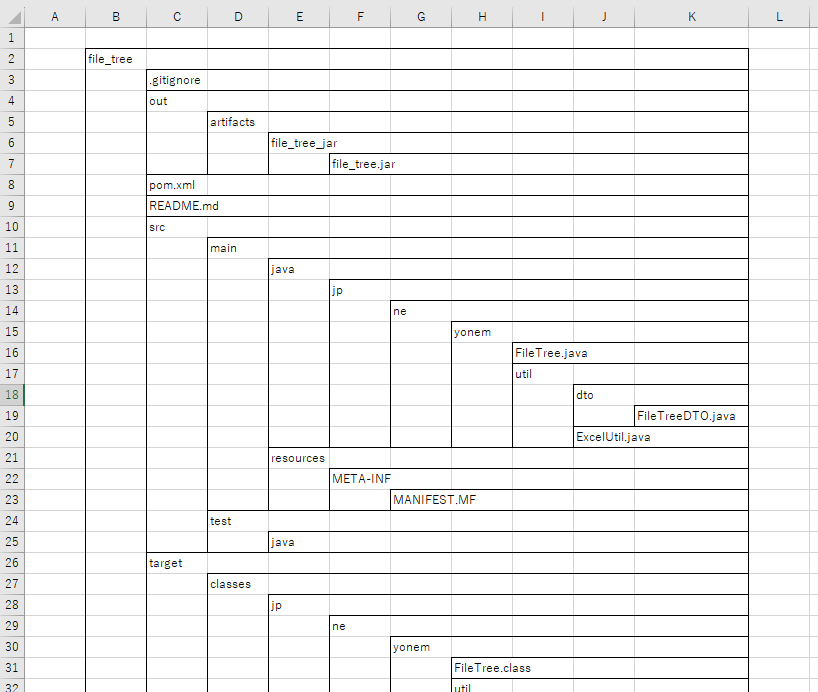

## 動作環境

- Java21で動作

2023/9/29現在  
https://www.oracle.com/java/technologies/downloads/#java21

### 使用ライブラリ

- Apache POI

Excel2007形式（ooxml）でExcel関連の処理を行う。

```xml

<dependency>
    <groupId>org.apache.poi</groupId>
    <artifactId>poi-ooxml</artifactId>
    <version>5.2.3</version>
</dependency>
```

## 操作方法

1. 起動時にディレクトリ選択のダイアログを表示
2. ツリーの起点となるディレクトリを選択する
3. 選択したディレクトリの直下に収集結果が出力される


