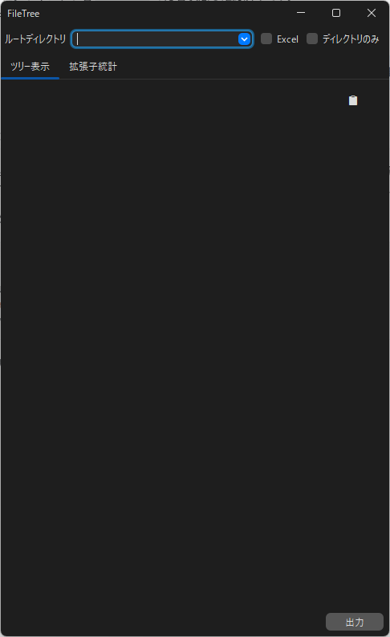
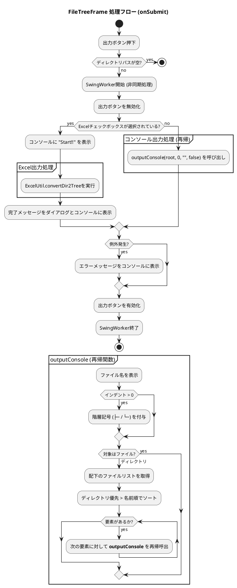
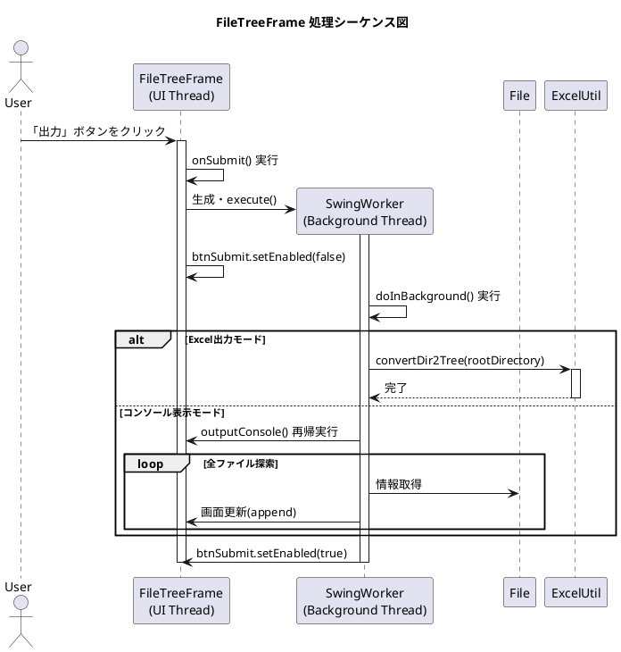

# FileTree

[](https://github.com/yonem/file-tree/actions/workflows/maven.yml)

選択したディレクトリを、見やすいツリー表示・Excel・拡張子別統計へ変換するJavaデスクトップアプリケーションです。ソース構成の把握、ファイル棚卸し、ディレクトリ構造の共有を素早く行えます。

## 主な機能

- ディレクトリ構造をツリー形式で画面へ表示
- ディレクトリだけを抽出して表示
- Excel形式のツリーを選択したディレクトリ直下へ出力
- 拡張子ごとのファイル数・総行数・平均行数を集計
- パス履歴、ドラッグ＆ドロップ、結果のコピー

## 画面イメージ



## 出力イメージ

Excel出力の例は[こちら](img/output_image.png)です。

## 動作環境

- Java 21
- Maven Wrapper 3.9.6（Maven本体の事前インストールは不要）

## 起動方法

### Windows

```text
.\mvnw.cmd -B -ntp clean package
java -jar target\file-tree-1.0.0.jar
```

### macOS / Linux

```text
./mvnw -B -ntp clean package
java -jar target/file-tree-1.0.0.jar
```

## 操作方法

1. 起動後、ルートディレクトリ欄をクリックして対象フォルダを選択する
2. 必要に応じて`Excel`または`ディレクトリのみ`を選択する
3. `出力`をクリックする
4. ツリー表示・拡張子統計を確認する。Excel出力時は対象ディレクトリ直下にファイルを作成する

## テストとCI

```text
.\mvnw.cmd -B -ntp clean test
```

macOS/Linuxでは`./mvnw -B -ntp clean test`を実行します。テストは6クラス・30件で、ツリー表示、Excel出力、統計、UI部品の正常系・異常系を確認します。詳細な実行結果は`target/surefire-reports`に出力されます。

GitHub Actionsでは、`develop`へのpushとpull requestを対象に、Java 21（Temurin）・Maven Wrapper・仮想ディスプレイ（Xvfb）で同じテストを実行します。

## 技術構成

| 分類 | 使用技術 |
| --- | --- |
| 言語・実行環境 | Java 21 |
| UI | Swing、FlatLaf |
| ビルド | Maven、Maven Wrapper |
| Excel出力 | Apache POI 5.5.1 |
| ログ | SLF4J、Logback |
| テスト | JUnit Jupiter、Mockito |
| CI | GitHub Actions |

## 制約事項

- 大規模なディレクトリでは、ファイル数や総行数の集計に時間がかかる場合があります。
- 統計の探索ではシンボリックリンクをたどりません。アクセス権がないディレクトリでは統計を取得できません。
- 読み取りに失敗したファイル、バイナリと判定したファイルは、行数0として集計します。バイナリ判定はMIMEタイプまたは先頭1,024バイトに含まれるNUL文字を使用します。
- テキストの行数はUTF-8として読み取ります。UTF-8以外の文字コードや破損したテキストは、行数0となる場合があります。
- Excel出力は対象ディレクトリへ書き込みます。

## エラーとログ

- 画面には処理の成否を示す簡潔なメッセージだけを表示します。詳細はアプリケーションログを確認してください。
- ログには処理種別、対象パス、出力モード、例外スタックトレースを記録します。ログや画面に秘密情報を入力しないでください。

---

## 設計図 (System Design)

### 処理フロー


```plantuml
@startuml
title FileTreeFrame 処理フロー (onSubmit)

start
:出力ボタン押下;
if (ディレクトリパスが空?) then (yes)
  stop
else (no)
  :SwingWorker開始 (非同期処理);
  :出力ボタンを無効化;
  
  if (Excelチェックボックスが選択されている?) then (yes)
    :コンソールに "Start!!" を表示;
    partition "Excel出力処理" {
      :ExcelUtil.convertDir2Treeを実行;
    }
    :完了メッセージをダイアログとコンソールに表示;
  else (no)
    partition "コンソール出力処理 (再帰)" {
      :outputConsole(root, 0, "", false) を呼び出し;
    }
  endif

  if (例外発生?) then (yes)
    :エラーメッセージをコンソールに表示;
  endif

  :出力ボタンを有効化;
  :SwingWorker終了;
endif
stop

partition "outputConsole (再帰関数)" {
  :ファイル名を表示;
  if (インデント > 0) then (yes)
    :階層記号 (├─ / └─) を付与;
  endif
  
  if (対象はファイル?) then (yes)
  else (ディレクトリ)
    :配下のファイルリストを取得;
    :ディレクトリ優先 > 名前順でソート;
    while (要素があるか?) is (yes)
      :次の要素に対して **outputConsole** を再帰呼出;
    endwhile
  endif
}
@enduml
```

### シーケンス図


```plantuml
@startuml
title FileTreeFrame 処理シーケンス図

actor User
participant "FileTreeFrame\n(UI Thread)" as UI
participant "SwingWorker\n(Background Thread)" as Worker
participant "File" as File
participant "ExcelUtil" as Excel

User -> UI : 「出力」ボタンをクリック
activate UI

UI -> UI : onSubmit() 実行
create Worker
UI -> Worker : 生成・execute()
activate Worker

UI -> UI : btnSubmit.setEnabled(false)

Worker -> Worker : doInBackground() 実行

alt Excel出力モード
Worker -> Excel : convertDir2Tree(rootDirectory)
activate Excel
Excel --> Worker : 完了
deactivate Excel
else コンソール表示モード
Worker -> UI : outputConsole() 再帰実行
loop 全ファイル探索
Worker -> File : 情報取得
Worker -> UI : 画面更新(append)
end
end

Worker -> UI : btnSubmit.setEnabled(true)
deactivate Worker
deactivate UI
@enduml
```
